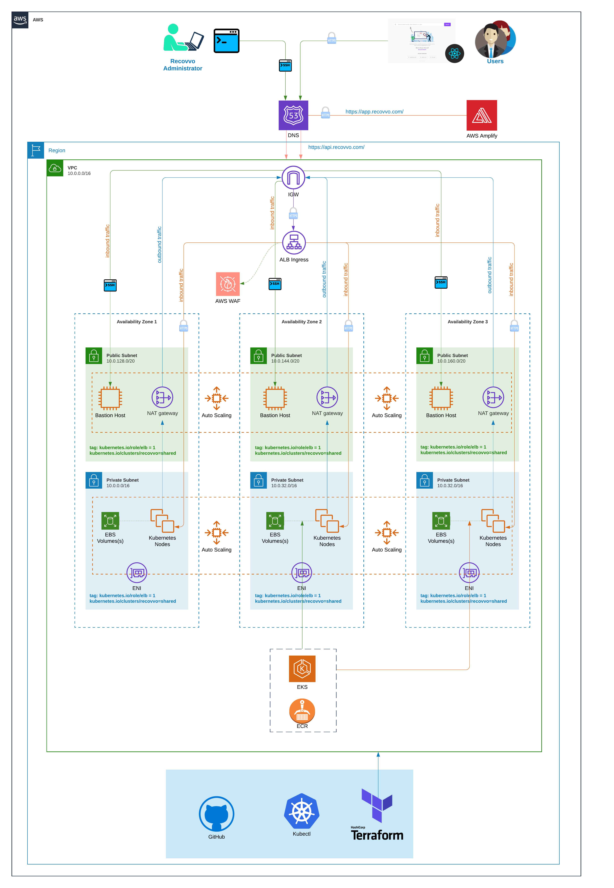

#  X Backend Infrastructure

## Table of Contents

* [Overview](#overview)
* [Variants during deployment of infrastructure](variants-during-deployment-of-infrastructure)
* [Development Setup](#development-setup)
  * [Prerequisites](#prerequisites)
  * [Installation](#installation)
* [Development Workflow](#development-workflow)
* [Infrastructure Deployment](#infrastructure-deployment)
* [Infrastructure Deletion](#infrastructure-deletion)

## Diagram


## Overview

X's infrastructure is provisioned using `Terraform` which provides us with declarative interface for managing cloud resources lifecycle. The main principle behind managing infrastructure as a code is `Idempotence`, which ensures deployment is consistent as a function of time and change. For instance, `resource` in the context of terraform could be ec2-compute in AWS cloud whose declarative configuration could look something like below:

```terraform
resource "aws_instance" "web" {
  ami           = "${data.aws_ami.ubuntu.id}"
  instance_type = "t2.micro"

  tags = {
    Name = "HelloWorld"
  }
}
```


Above resource declaration is written in language known as `HCL` which stands for Hashicorp Configuration Language developed by Hashicorp whose semantics is equivalent to JSON configuration. Terraform with the given resource definition is then responsible for managing lifecycle which includes:

| Phase    | Equivalent `Terraform` Command |
|----------|------------------------------|
| Creation | `terraform apply`              |
|  Update  | `terraform apply`              |
|  Deletion  | `terraform destroy`            |

There are following top level resource definition within Singular Keys's infrastructure. They are as follows:
- Amazon Elastic Kubernetes Service Master
- Amazon Elastic Kubernetes Service Workers
- VPC
- Amazon Elastic Container Registry
- AWS ingress controller
- Route 53
- S3 Bucket
- Bastion Hosts
- AutoScaling Groups

## Variants during deployment of infrastructure

### Terraform state file

Any deplyment of actual aws resources such as ENI, ECR or ingress load balancer through terraform results in a state file which represents the current state of deployed resources within AWS. This state file has an extension of `.tfstate` which is maintained at terraform cloud. Way of managing terraform state files in some remote location during terraform deployment/apply is called `remote deployment strategy`. The reason behing keeping the statefile in central place such as terraform cloud have following advantages:

1. We have single source of truth for any changes into the infrastructure.
2. Two concurrent modification of resources is prohibited as any arbitary deployment needs to acquire lock for making changes to resources which results in another deployment to fail.
3. We can prevent arbitary deployment by manually locking statefile.
4. We can provision access control around the statefile and only allow trusted individual to actually make changes to infrastructure (using workspace)

### Workspace

In terraform, any terraform stateful shoud reside within workspace. We can think of workspace as a way of namespacing the statefile. This allows administrator to provision access control by only allowing `release team` to make changes to terraform deployment. For instance, we could isolate environment and stages by workspace and assign users to dedicated developers/devops.

### Locks in terraform

During planning and applying terraform code, terraform, by default, generated statefile in machine where `terraform plan` and `terraform apply` was executed. This is horrible practise as this might lead to state file maintained within local machine and not in central location. Also, multiple `terraform apply` can be initiated at the same time which would in programming term result in `datarace`. This is something we want to avoid. Hence, we need to maintain a consistent lock during `terraform apply`. This can achieved by using combination of cloud storage and database(dyanamo DB). However, this we can use terraform cloud to simply use their locking mechanism and don't need to maintain our own setup for locks.

### Note during deletion of infrastructure

During deletion using `terraform destroy`, terraform would delete all of the resources except `Dangling resources`. Dangling resources are those resources whose lifecyle is not managed by terraform and instead these are created indirectly by managed resources such as EKS(Elastic kubernetes Service). For instance, EKS would deploy ALB for ingress controller to route incoming traffic to EKS's gateway/ http reverse proxy.

Also, in some cases Persistent Volumes which are dyanamically mouted to Ec2 worker nodes via Persistent Volume Claims(PVCs) would faile to unmount and destroy when we destroy  EKS master and EKS worker nodes. In this particular scenario, we need to manually delete the EBS volumes created as the result of PVCs.

Similarly, terraform fails to delete any object storage(s3 bucket) if we have a contents inside that storage object. Hence, we need to make sure we delete all the contents of all versions within object storage before calling `terraform destroy`.

Therefore, steps to destroy infrastructure are as below:

1. Delete all the deployment inside EKS cluster via greping namespaces.
```sh
ls | grep dev- | awk '{print $1}' | xargs kubectl delete
```
This would all the deployments whose namespace is prefixed by `dev-`. This would result in deletion of actual aws resources if any deployment happen to manage PVs and ingress controller.
2. Delete contents of all the object storage.
3. Finally, run `terraform destroy`.

> Note, sometime terraform destroy would fail. World is not perfect and will never be. In this case, we need to go beyond terrraform destroy and have to manually fix the statefile using `terraform state` command provided by terraform. This command is advanced and should only be used if something went down the graveyard. This command will let us remove, list and change state manually.

> Again, Don't use it. There must be a way.

## Development Setup

### Prerequisites

* [Docker](https://docs.docker.com/install/)
* [Git](https://git-scm.com/downloads)
### Installation

##### 1. Clone the repository

```sh
git clone git@bitbucket.org:invisibleauth/infrastructure.git
```

##### 2. Create `.terraformrc` file inside your root directory with the following content. Note: Get the required token from [terraform cloud](https://www.terraform.io/).

```
credentials "app.terraform.io" {
  token = "*********************"
}
```


##### 3. Create environment file based on template file located inside `env/Makefile.override.example`
   * Create a environment file called `Makefile.override.dev` inside `env` directory as `env/Makefile.override.dev`. From root directory, run the below shell command.
   ```sh
   cd env/
   cp Makefile.override.example Makefile.override.dev
   ```

##### 4. Create new workspace or use the existing workspace for terraform state management

>We isolate the terraform environment using the `workspace` so it is important that you create a new workspace when you are working on new feature. This prevents messing up existing environement i.e prod, dev, qa.

##### To create new workspace

Set a env variable in Makefile.override.dev `TF_WORKSPACE` as `TF_WORKSPACE ?= new-workspace`.
Run the following shell command.
```sh
make docker/terraform-create-workspace
```
>Note: Set the execution mode from `Remote` to `Local` in [terraform cloud](https://app.terraform.io). This option should be located in `settings > General`. This needs to be done as we are using local machine to drive changes to terraform and we need to explictly set the execution mode to `Local` as it will pick up the environment variables from our local machine in order to run terraform commands.

##### To use existing workspace

Get the list of workspace by running following shell command.
```sh
make docker/terraform-list-workspace
```
And finally paste the name of workspace in `Makefile.override.dev` as `TF_WORSPACE ?= workspace-name`.

##### 5. Initialize the project
This initialization would install all the necessary plugins and download terraform modules required by the project.
```sh
make docker/terraform-init
```
> Congratulations!! You should now be able to contribute to writing terraform modules from your local development environment.

## Development Workflow

When you make any changes to existing terraform codebase. Here are the steps that someone must adhere to:
#### 1. Lint terraform configuration
```sh
make docker/terraform-lint
```

#### 2. Format terraform configuration
```sh
make docker/terraform-format
```

#### 3. Output terraform plan
```sh
make docker/terraform-plan
```

#### 4. Apply terraform plan
>Note: Changes should always be drived via Travis CI and strictly not from local machine.
```sh
make docker/terraform-apply
```

#### 5. Destroy the resources provisioned by terraform
>Be careful and double check the workspace you are currently in as this might mistakenly cause resources managed by other workspace to be deleted if you ever happen to unkowningly set the different workspace from environment variable.
Note: Destruction should always be drived via Travis CI and strictly not from local machine.

```sh
make docker/terraform-destroy
```

## Infrastructure Deployment
Steps that strictly needs to be accomplished for deployment:

##### 1. Make sure following environment variables are set within CI pipeline
* AWS_ACCESS_KEY_ID
* AWS_SECRET_ACCESS_KEY
* DEPLOY
Setting this to `False` would skip the deployment. It explicitly needs to be `True` in order to deploy the infrastructure.
* SSL_KEY
Required to decrypt token inside `terraformrc.enc`
* SSL_IV
Required to decrypt token inside `terraformrc.enc`
* RESTORE
Setting this to `True` would trigger the deployment of frontend application after the infrastructure setup completes.
* TF_VAR_availability_zones
List of availability zones where EKS workers are distributed. Example: `"[\"eu-west-2a\", \"eu-west-2b\", \"eu-west-2c\"]"`
* TF_VAR_kubeconfig_path
Path where kubeconfig should reside within worker compute. Example: `/home/bitbucket/.kube/config`
* TF_VAR_region
Name of AWS region where infrastructure needs to be deployed.
* TF_VAR_route53_root_domain_name
Root domain name. Example: `x.com`
* TF_VAR_stage
Name of the stage. Example `dev`, `prod`
* TF_WORKSPACE
Name of the workspace where we maintain terraform state. Note: This needs to exists in terraform cloud before the deployment can happen.

##### 2. Trigger the deployment
Any of this combinations could trigger the deployment of infrastructure.
* Commit to master branch and environment variable `DEPLOY` is set to `True`
* Merge to master branch and environment variable `DEPLOY` is set to `True`

## Infrastructure Deletion
Steps that strictly needs to be accomplished for deployment:

##### 1. Empty contents of S3 buckets created by the deployment
In future, this could be automated via scripts.

##### 2. Delete all the deployments within kubernetes cluster
> Note: This should cause clean up resources such as ALB, Persistent Volumes (PVS) and any other dangling resources created by kubernetes and not the terraform.

##### 3. Set the environment variable `DEPLOY` to `False` in Bitbucket Pipeline
Below must be the values of environment variables in Repository Variables:
* `DESTROY = True`
* `DEPLOY = False`
* `RESTORE = False`

##### 4. Trigger the Deletion of infrastructure
We could trigger the deletion by making commit or manually restarting build from Bitbucket CI with correct set of environment variables defined above.
